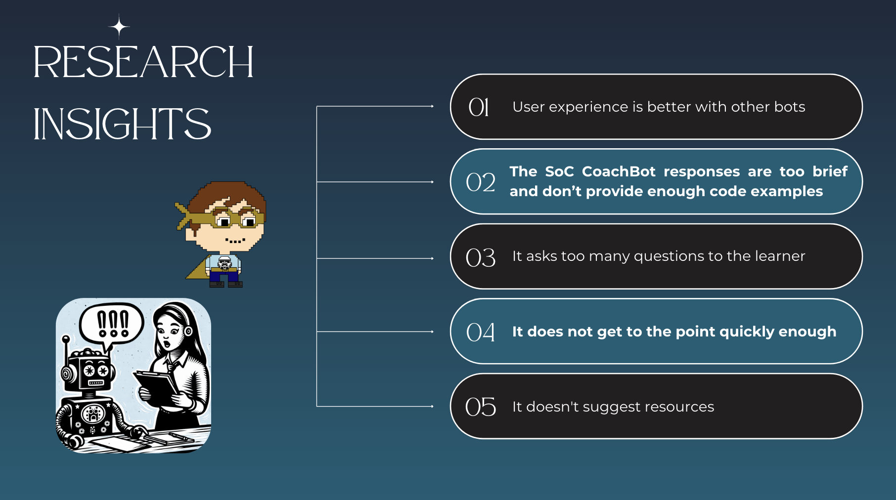

<a href="https://soc-llm.vercel.app/"> 
  
  <h1 align="center">School of Code CoachBot</h1>
</a>


<p align="center">
CoachBot: your guide, your mentor, your learning companion; a transformative experience that goes beyond your regular chatbots. With insights, resources, and quizzes, it propels learners forward. Say farewell to shallow interactions. Our CoachBot: the catalyst for learning excellence.
</p>

<p align="center">
  <a href="#links"><strong>Links</strong></a> ·
  <a href="#gpt model version"><strong>GPT Model Version</strong></a> ·
  <a href="#Creating a KV Database Instance"><strong>Creating a KV Database Instance</strong></a> ·
  <a href="#Notion Database"><strong>Notion Database</strong></a> ·
  <a href="#Running locally"><strong>Running locally</strong></a> ·
  <a href="#authors"><strong>Authors</strong></a>
</p>
<br/>

## Links
- Live Demo : https://soc-llm.vercel.app/
- GitHub Repository : https://github.com/SchoolOfCode/bc16-final-projects-team-large-language-mavericks
- Project Presentation Video : https://www.youtube.com/watch?v=69QqHgv90Ss
- Presentation Slides : https://coachbot.my.canva.site/coachbot

---





#  GPT Model Version

This project uses OpenAI `gpt-3.5-turbo` as the default but can be easily changed in the `./lib/chat/actions.tsx` file to a version of your choice.

# Environment Variables 

To run this project, you will need to add the following environment variables to your .env file

## Open AI Set-up  
To use OpenAI's API you must provide you own key
You must first activate a Billing Account [here](https://platform.openai.com/account/billing/overview)  
Then get your OpenAI API Key [here](https://platform.openai.com/account/api-keys)

Now you can update your OpenAI API key in your .env file as shown in the .env.example to send/receive responses from OpenAI

## Creating a KV Database Instance

To use the Login and chat history functionality the relevent information is stored in a KV database by default. 

Follow the steps outlined in the [quick start guide](https://vercel.com/docs/storage/vercel-kv/quickstart#create-a-kv-database) provided by Vercel. This guide will assist you in creating and configuring your KV database instance on Vercel, enabling your application to interact with it.

Remember to update your environment variables 

``` yaml
KV_URL=" "  
KV_REST_API_URL=" " 
KV_REST_API_TOKEN=" " 
KV_REST_API_READ_ONLY_TOKEN=" " 
``` 
in the `.env` file with the appropriate credentials provided during the KV database setup.

## Notion Database
This project retrevies information from a Notion database to give the LLM more context and information about the School of Code

For the Notion database to work without needing to change the system prompt you will need to use tags to identify the files in your database. 

For the LLM to read your curriculum tag one file as `curriculum`. The link to this should be a Notion document for the LLM to read.  

To set up your Notion databse you will need to update your .env to contain both :  

```yaml
NOTION_API_DB_ID=" " 
NOTION_API_KEY=" "
```

These can both be set up [here](https://www.notion.so/help/guides/creating-a-database)

To get an API key you need to create an intergration as described [here](https://developers.notion.com/docs/create-a-notion-integration)

Example for reference below :


## Running locally

You will need to use the environment variables defined in [`.env.example`](.env.example) to run the CoachBot. 

> Note: You should not commit your `.env` file or it will expose secrets that will allow others to control access to your various OpenAI and authentication provider accounts.

- GitHub Repository : https://github.com/SchoolOfCode/bc16-final-projects-team-large-language-mavericks

Clone the project

```yaml
  git clone https://github.com/SchoolOfCode/bc16-final-projects-team-large-language-mavericks.git
```

Go to the project directory

```yaml
  cd bc16-final-projects-team-large-language-mavericks
```

Install dependencies

```yaml
  npm install
```
 or
```yaml 
  pnpm install
```

Start the server

```yaml
  npm run dev
```
or
```yaml
  pnpm dev
```

Your app template should now be running on [localhost:3000](http://localhost:3000/).

# Authors

This School of Code project was built by the **Large Language Mavericks**:

[@nashetty](https://github.com/nashetty)  
[@mrw46](https://github.com/mrw46)  
[@Ludwig-J](https://github.com/Ludwig-J)  
[@yuliiastrizhalko](https://github.com/yuliiastrizhalko)


## Acknowledgements

The CoachBot was built on a Next.js boilerplate using this [library](https://vercel.com/templates/next.js/nextjs-ai-chatbot) which was created by [Vercel](https://vercel.com) and [Next.js](https://nextjs.org) team members, with contributions from:

- Jared Palmer ([@jaredpalmer](https://twitter.com/jaredpalmer)) - [Vercel](https://vercel.com)
- Shu Ding ([@shuding\_](https://twitter.com/shuding_)) - [Vercel](https://vercel.com)
- shadcn ([@shadcn](https://twitter.com/shadcn)) - [Vercel](https://vercel.com)
